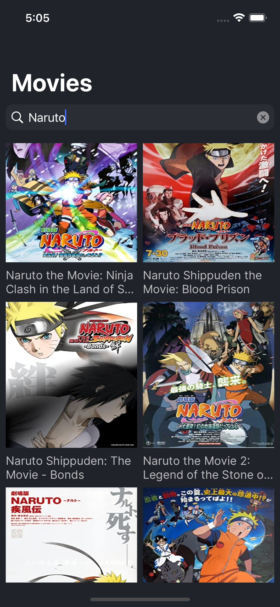
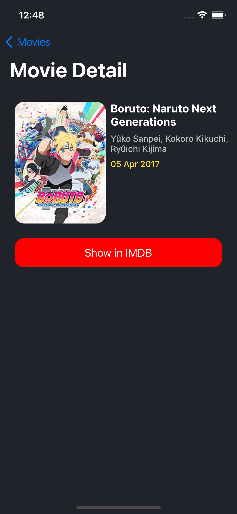
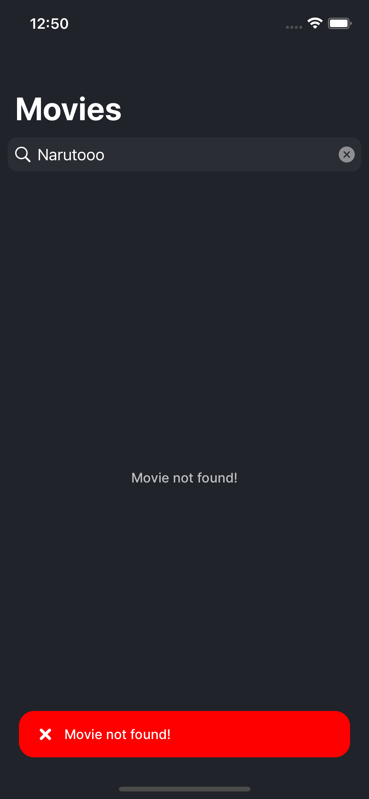

# MovieX

It's Movie app that using the OMDB API.

# Pods

```yaml
  pod 'Kingfisher', '~> 7.0'
  pod 'lottie-ios'
  pod 'SwiftGen', '~> 6.5.1'
  pod 'Firebase/RemoteConfig'
  pod 'Firebase/Core'
  pod 'FirebaseMessaging'
  pod 'SwiftEntryKit', '2.0.0'
  pod 'Alamofire', '~> 5.4'
  pod 'TinyConstraints', '~> 4.0'

```

# Screens
   
